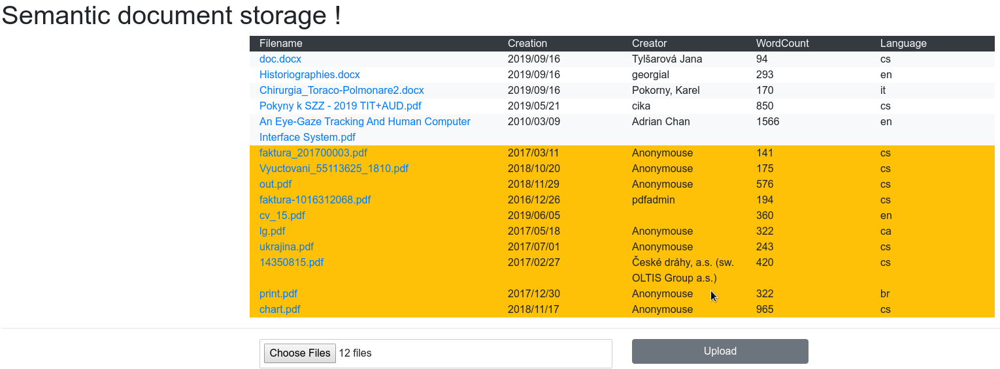

Application
====================
Simple application which provide document storage.
Speciality of this application is, that there is some semantic future (Language, WordCount, Author, Creation)

Common
---------
For right functionality user needs accessible docker and kubernetes commands like ```docker``` and ```kubectl```


Makefile
---------
There are some commands used to build/run all applications in a raw docker.
Most of these commands are for test purpose only, but there are two important commands:

1. ```make frontend_build``` - make frontend application
2. ```make backend_build_push``` - create a docker image with backend application and push it to the Docker registry


Backend
---------
As a backend is used python flask framework with basic extensions (sqlalchemy, restx, uuid etc.)
I picked up this solution because my knowledge of python is better than Java.

Application is very simple and I picked up Flask as a thinner framework that supports test, swagger API definition, declarative pattern...
All methods in the application used static typing.
I used ORM SQL Alchemy extensions for database operations because it was a simple project and I think, that is a strong domain of ORM.
There are migrations to make the database consistent before execution.

There are two simple endpoints.

1. The first endpoint (```/api/v1/document/```) is used for uploading new documents (post method) and show all (get method) uploaded documents.
    * Tika endpoint:

      When some file is uploaded, backend application uses tika's ```/meta``` endpoint. This endpoint is sufficient for DOCX documents,
      but if there is a PDF document, there is a problem with WordCount attribute. So there is another part to get WordCount from the raw text (tika's ```/tika```, which is a little bit tricky.

    * Hash function:

      All documents have a calculated hash function. It may prevent uploading multiple same documents to the application.

2. Second endpoint (/api/v1/document/{uuid:uuid}/) is used for download picked document from a application/database.

* For more tasks with semantic analysis will be better to use separated workers connected with some MQ broker

```
make backend_build_push
```

Database
---------
As a database, I used Postgresql, because PostgreSQL is a well-documented standard and is good to use in a production environment.
For document storage, I prefer some solution for store files, like a CEPH or store the document to filesystem and metadata to a database.

Another potential problem is in PostgreSQL Master to Master replication.
There are some solutions, but...

Database data are stored at /storage/database


Frontend
---------
As a frontend framework, I used Svelte, because is super easy to use and my old experience with AngularJS (1.6) is so obsolete.
There is no SPO storage that will be better. I used a simple list to store documents meta.
Another thing is, that documents have calculated hash functions (Sha256, Sha1, and md5) for preventing multiple uploading same document,
but there is no place to show.

* Application is very naive (missing SPO storage, new documents are simple append, etc.)
* There is no delete option, but I missed it in the task.

```
make frontend_build
```



There is a possibility to works with ```npm run dev``` and ```npm run build```


Tika
---------
Tika endpoint is used Docker image logicalspark/docker-tikaserver... There are no changes...


Nginx
---------
There is an Nginx server as a glue to connect frontend pages and backend API to one service.
Configuration of nginx is store at /storage/nginx
Frontend web pages are generated to /storage/frontend

Kubernetes
----------
Kubernetes deploy files are located in kubernetes folder.

There are deployments:

* docapi-postgresql.yaml - deploy postgresql database listening to port: 5432
* docapi-tika.yaml - deploy tika server listening to port: 9998
* docapi-backend.yaml - deploy backend api listening to port: 5000
* docapi-nginx.yaml - deploy nginx server as a glue, listening to port: 80 - there is no ssl connection (problematic, missing valid domain etc.)

simple command to deploy on kubernetes is:

```make kubernetes```

There are no true storage endpoints. I mapped storage to the physical directory.
So, you must edit paths or change volumes.
All kubernetes services are very naive. It wants to have a production environment or better skills.

problem:
* I must use public docker registry - I had problem to get local docker image to kubernetes
