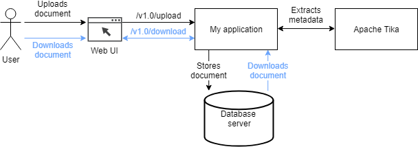
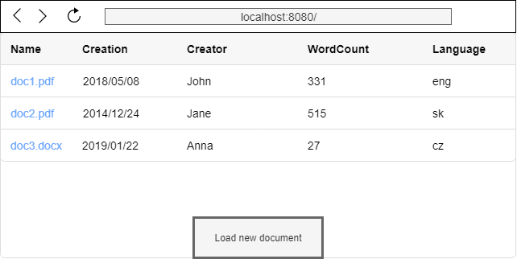

# KMLE - Homework #

## Task ##

Create a simple web application which can load a document and extract its metadata. Extracted information 
will be visualized to the user and the loaded document should be downloadable.

### App Description ###
The application provides an interface to upload the document from the user. This document will be classified 
for specific metadata (Name, TimeOfCreation, Creator, WordCount, Language). Part of the classification 
procedure is to store the document to the database so it can be downloaded later. The application 
accepts only documents with <b>docx</b> and <b>pdf</b> extensions.

- Design and create REST controller which serves at least two endpoints (upload document and download document).
- Use standalone version of [Apache Tika](http://tika.apache.org/) as an engine for extraction of metadata from the loaded document.
- Choose some open-sourced database engine where uploaded documents will be stored in.
- Configuration should be externalized so the application could be used on different environments.

##### Tips:
- Tika serves multiple endpoints in order to provide different kind of information from the given document.
 Feel free to combine these endpoints in order to extract all required metadata from the document.
- Following image of Tika server is able to extract all required metadata: logicalspark/docker-tikaserver
 
Picture below is a scheme of mentioned use cases. <b>Black</b> flow shows user who uploads the document from 
their computer which is extracted and stored immediately. The <b>blue</b> flow describes user downloading the 
document from the application.

### Environmental demands ###
The application is supposed to be running in Kubernetes environment. To satisfy this requirement you 
are challenged to:
 
1) Create a Dockerfile for your application. 
2) Create Kubernetes descriptors for your application, Tika and database server.

##### Tips:
- Use MicroK8s/Minikube to setup light version of Kubernetes locally.
- Feel free to use existing Kubernetes descriptors for database and Tika engines. 

### GUI ##
The application will visualize extracted metadata in a table where each row stands for 
one document (add new row with every new processed document). Also there is an option to upload the document and download specific document from the table view.

Example of the GUI (clicking the name of the file triggers download action):

